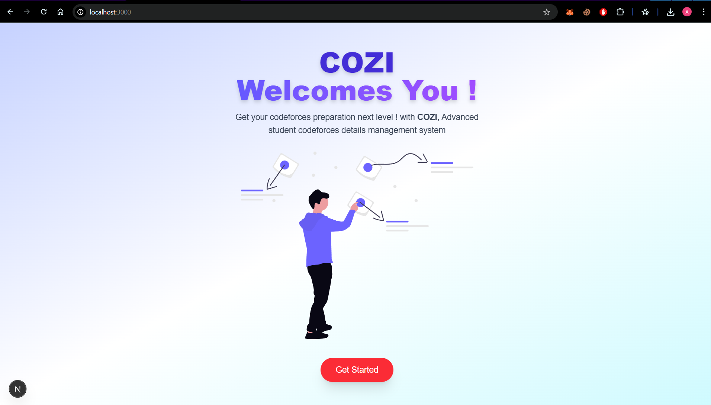

# 🎓 Student Management System (COZI)

A modern, full-stack application for managing student records with real-time Codeforces integration, inactivity tracking, and email reminders — built using the MERN stack.

## 📌 Features

###  Student Management
- Add, edit, and delete student records
- View detailed student profile including:
  - Codeforces handle
  - Current and max rating
  - Recent contests and activity

### ⚙️ Codeforces Integration
- Fetches data directly from the [Codeforces API](https://codeforces.com/api/)
- Shows latest contests and rating updates
- Updates data automatically when a student is added

### 📧 Inactivity Email Notifications
- Sends automated email reminders to inactive students
- Triggered when no Codeforces submissions are found in the last 7 days
- Toggle email reminders on/off per student

### 📂 CSV Download
- Download the complete student dataset as a CSV file

### 🔐 Authentication 
- Login for admins to manage data securely

---

## 🛠️ Tech Stack

| Tech | Description |
|------|-------------|
| **Frontend** | Next.js (React 18), Tailwind CSS |
| **Backend** | Node.js, Express.js |
| **Database** | MongoDB + Mongoose |
| **Email** | Nodemailer with Gmail SMTP |
| **Other Tools** | Codeforces Public API, dotenv, Framer Motion |

---

## 📷 Screenshots

### Homepage



---

## 🧑‍💻 Installation & Setup

1. **Clone the repo**
```bash
git clone https://github.com/your-username/student-management-system.git
cd student-management-system
npm install 
npm run dev
```
For Backend initialization
```bash
cd Backend
npm install
nodemon server.js or node server.js
```


